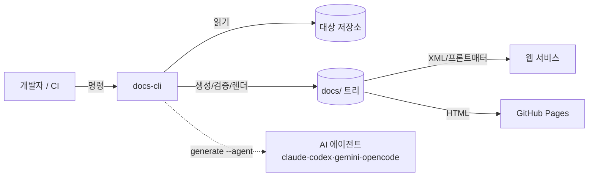

# 아키텍처 개요

> 시스템 컨텍스트·컨테이너·컴포넌트 뷰
>
> _이 문서는 `docs-cli` 표준 스키마 v1을 따릅니다._

## 시스템 컨텍스트

`docs-cli` 는 로컬 우선(local-first) CLI 다. 외부와의 상호작용은 선택적인 AI 에이전트 호출과 릴리스 배포로 한정된다.

## 컨테이너 / 런타임 단위

`docs-cli` 는 단일 실행 파일이며, 런타임에 외부 서비스를 띄우지 않는다. 내부는 명령 디스패처와 도메인 패키지로 나뉜다.

| 단위 | 책임 |
| --- | --- |
| `cmd/docs-cli` | 프로세스 진입점 (`os.Args` → `cli.Run`) |
| `internal/cli` | 명령 디스패치·플래그 파싱·종료 코드 |
| 도메인 패키지 | `schema`(표준), `scaffold`, `agent`, `validate`, `render`, `skill`, `project` |
| 공용 파서 | `internal/mddoc` — 프론트매터 + 헤딩 |

선택적 외부 프로세스는 AI 에이전트 CLI 뿐이며, `agent.Runner` 인터페이스 뒤에서 비대화형으로 실행된다.

## 품질 속성

| 속성 | 목표 | 보장 방법 |
| --- | --- | --- |
| 결정성 | 같은 입력 → 같은 산출물 | 스캐폴딩은 순수 함수, 날짜/커밋만 주입 |
| 이식성 | 의존성 0 | 표준 라이브러리만 사용, 정적 바이너리 |
| 일관성 | 도구 간 산출물 정합 | 단일 출처 스키마를 4개 도구가 공유 |
| 검증성 | 품질을 기계가 판정 | `validate` + 패키지 테스트 |
| 이식 대상성 | 웹 서비스 ingest | 고정 프론트매터 키 + XML 구조 |

## 횡단 관심사

- **단일 출처:** 모든 구조적 결정은 `internal/schema` 에 모인다. 다른 패키지는 이를 읽기만 한다.
- **오류 처리:** CLI 는 의미 있는 종료 코드(0/1/2/3/4)로 결과를 표현한다. (자세히는 [cli-reference](./cli-reference.md))
- **IO 분리:** 생성 로직(순수)과 디스크 쓰기(`scaffold.Write`)를 분리해 테스트 가능하게 둔다.
- **에이전트 추상화:** 실제 에이전트 실행은 `agent.Runner` 인터페이스로 감싸 테스트에서 가짜 러너로 대체한다.
