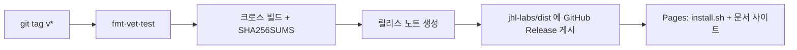

# 빌드 · 릴리스

> 빌드·버전 관리·릴리스 파이프라인
>
> _이 문서는 `docs-cli` 표준 스키마 v1을 따릅니다._

## 빌드

```bash
make build                 # bin/docs-cli (버전/커밋/날짜 주입)
go build ./cmd/docs-cli    # 빠른 로컬 빌드
go test ./...              # 테스트
```

외부 의존성이 없어 인터넷 없이도 빌드된다. 크로스 컴파일은 `scripts/build-release-artifacts.sh` 가 처리한다.

| 대상 | GOOS/GOARCH |
| --- | --- |
| Linux | amd64, arm64 |
| macOS | amd64, arm64 |
| Windows | amd64, arm64 |

## 버전 관리

- **SemVer** 태그(`vMAJOR.MINOR.PATCH`)를 사용한다. 프리릴리스는 `v0.1.0-rc.1`.
- 버전·커밋·날짜는 빌드 시 `-ldflags` 로 `internal/version` 에 주입된다.

```bash
go build -ldflags "-X github.com/jhl-labs/docs-cli/internal/version.Version=v0.1.0 ..." ./cmd/docs-cli
```

- 표준 문서 스키마 자체의 버전은 `schema.SchemaVersion` 으로 별도 관리한다. 스키마 구조가 바뀌면 이 값을 올린다.

## 릴리스 파이프라인

태그를 push 하면 [`release-dist.yml`](../.github/workflows/release-dist.yml)이 동작한다.



1. 포맷·모듈·vet·테스트 검사.
2. 6개 플랫폼 빌드 + `SHA256SUMS` 생성.
3. 직전 태그 이후 커밋으로 릴리스 노트 작성.
4. `DIST_REPO_TOKEN` 으로 공개 `jhl-labs/dist` 저장소에 `docs-cli-<version>` Release 게시.
5. `docs/**` 변경 시 [`pages.yml`](../.github/workflows/pages.yml)이 문서 사이트와 `install.sh` 를 배포.

자세한 절차는 [Release 가이드](../guides/dist-release.md)를 참고한다.
