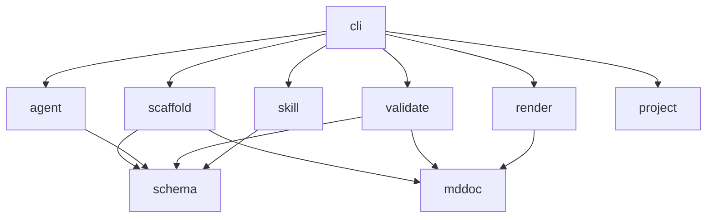

# 컴포넌트 설계

> 모듈 경계·책임·의존 규칙
>
> _이 문서는 `docs-cli` 표준 스키마 v1을 따릅니다._

## 모듈 지도

```text
cmd/docs-cli/          진입점
internal/version/      버전 정보 (-ldflags 주입)
internal/schema/       표준 문서 패턴 — 단일 출처
internal/mddoc/        프론트매터 + 헤딩 파서/직렬화
internal/project/      구현 언어 감지 (py/ts/go/rust/c#/java)
internal/scaffold/     init — 스키마 → docs/ 트리 생성
internal/agent/        에이전트 어댑터 + 프롬프트 빌더 + Runner
internal/validate/     표준 정합성 검사
internal/render/       Markdown → HTML / XML
internal/skill/        SKILL.md 생성기
internal/cli/          명령 디스패치·플래그·도움말
```

| 패키지 | 책임 | 핵심 타입/함수 |
| --- | --- | --- |
| `schema` | 표준 패턴 정의 | `Schema`, `Document`, `Chapter`, `Standard()` |
| `mddoc` | 문서 파싱/직렬화 | `Parse`, `Frontmatter.Marshal` |
| `project` | 언어 감지 | `Detect` |
| `scaffold` | 트리 생성 | `Build`, `Write` |
| `agent` | 에이전트 호출 | `Agent`, `Runner`, `BuildPrompt` |
| `validate` | 정합성 검사 | `Run`, `Report` |
| `render` | 출력 변환 | `HTML`, `XML` |
| `skill` | 스킬 생성 | `Generate` |

## 의존 규칙

의존은 한 방향으로만 흐른다. `cli` 가 도메인 패키지를 조립하고, 도메인 패키지는 `schema`/`mddoc` 같은 하위 계층만 참조한다.



**금지:** 도메인 패키지가 `cli` 를 import 하거나, `schema` 가 다른 internal 패키지를 import 하는 역방향 의존.

## 경계와 확장점

- **새 문서/챕터:** `internal/schema/schema.go` 만 고친다. 스캐폴더·검증기·프롬프트·스킬이 자동으로 따라온다.
- **새 출력 포맷:** `render` 에 변환 함수를 추가하고 `cli.formatTarget` 에 매핑을 등록한다.
- **새 에이전트:** `agent.registry` 에 한 줄(이름·바이너리·인자 prefix)을 추가한다.
- **에이전트 실행 대체:** `agent.Runner` 인터페이스를 구현해 주입한다(테스트의 `fakeRunner` 가 예시).
